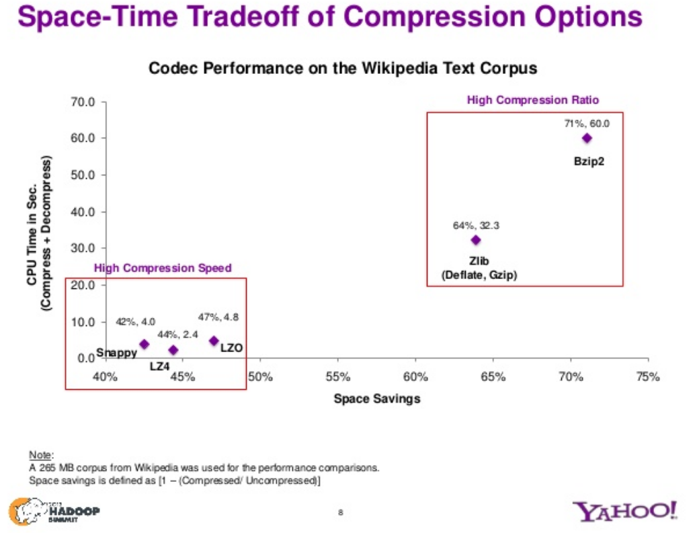

# Query in Spark with Scala

> Question: what does `.collect()` do? What if I don't call `.collect()` and simply just assign this `spark.sql` to a `var`? 

```scala
import spark.implicits._

val df = spark.read.parquet(path)
df.createOrReplaceTempView("QTable")

spark.sql("set spark.sql.optimizer.nestedSchemaPruning.enabled=true")
val result = spark.sql("SELECT COUNT(*) FROM QTable WHERE country IN ('US', 'CA', 'MX') AND month(from_unixtime($'date', 'yyyy-MM-dd')) == 'Dec'").collect()

```

# Algorithms

> Question: Implement two functions. One is `add(word)`, the other one is `getTopNWords(n)`  which returns a descending list of words ordered by the frequency. 

Because we want to have `O(1)` time complexity for the `add(word:String)` function, the first thing I could think of is using a dictionary(Python)/HashMap(Java). However, we also need to have a `O(n)` time complexity for `getTopN(n:Int)`, which returns a descending ordered by the frequency, then if I were to only use a dictionary, then sorting it won't easily give me `O(n)` time complexity.

So the plan is to create a data structure that is consist of a DoublyLinkedList of key-value pairs. 

> Pseudo code:

```python
class Node:
    def __init__(self, next=None, prev=None, data={}):
        self.next = next
        self.prev = prev
        self.data = data  # where data is a key-value pair

class DoublyLinkedList:
    def __init__(self):
        self.head = None

    def push(self, new_data):
        pass
    def insertAfter(self, prev_node, new_data):
        pass
    def append(self, new_data):
        pass

def add(word):
    addWordToNode               # HashTable insertion: O(1)
    addWordToDoublyLinkedList   # DoublyLinkedList insertion: O(1)

def getTopN(n:Int) : List<String,Int>:
    sortDoublyLinkedList        # Use Mergesort/Timsort, which will give us O(nlog(n))
    returnThefirstNNodes

```


# General Questions

### Q1 How many Name Nodes can you have in a given Hadoop Cluster?

For version [2.x of Hadoop](https://hadoop.apache.org/docs/r2.10.0/hadoop-project-dist/hadoop-hdfs/HDFSHighAvailabilityWithNFS.html), you can only have 2 NameNodes (1 primary 1 standby) in a HA configuration. However, you can have more NN with [Federated Name Nodes](https://hadoop.apache.org/docs/r2.10.0/hadoop-project-dist/hadoop-hdfs/Federation.html) configurations.

For version [3.x of Hadoop](https://hadoop.apache.org/docs/r3.0.0/hadoop-project-dist/hadoop-hdfs/HDFSHighAvailabilityWithNFS.html), you can have more than 1 standby NN in an HA configuration.

### Q2 Do you need HBase to have a functional Hadoop Cluster? If you do need HBase, how many HBase nodes can you have for each Hadoop Cluster?

HBase can be deployed without Hadoop, so I don't see why we couldn't have as much HBase node as possible? Also, according to the documentation [here](https://docs.cloudera.com/HDPDocuments/Ambari-2.7.4.0/managing-high-availability/content/amb_configuring_hbase_high_availability.html) by using Apache Ambari we can easily setup multiple HBAse Masters (including numbers of Standbys)

### Q3 Speak more about which compression would you use for storage when using Hadoop?

I think this really depends on specific use cases, do we care more about computes efficiency or storage efficiency? 

Given the slides from Yahoo's talk on Hadoop, if we care more about compute efficiency, then using Google's Snappy is probably the best. However, if we care more about storage efficiency, then using bzip2 is the best. 

Since we are loading the data into Hadoop, a compute cluster framework, then perhaps a decent compute time is a necessary criteria, then to choose from zip, gz, bz2, gz is the most balanced choice in terms of compute as well as storage efficiency. 


